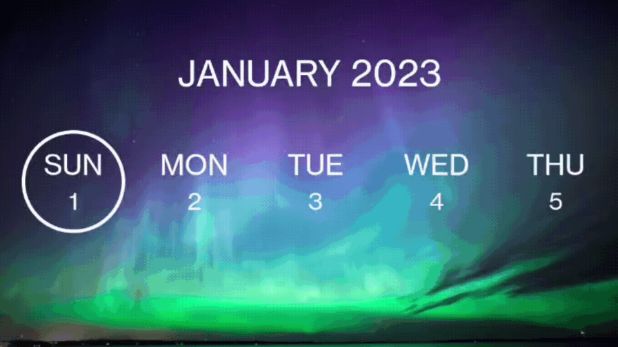

# Horizontal-Infinite-Scrollable-Calendar-View-Android

Easy to use Horizontal Calendar View without dealing with messy RecyclerView.

[](https://jitpack.io/#Abhay-cloud/Horizontal-Infinite-Scrollable-Calendar-View-Android)

 

## Features
- Set Start Date
- Set Multiple Special Dates
- Set normalDate, selectedDate, specialDate backgrounds.
- Set normalDate, selectedDate, specialDate day & date text colors
- show/hide title
- listen to date & month change events

## Implementation
#### Step 1. Add the JitPack repository to your build file
Add it in your root build.gradle at the end of repositories:
```
allprojects {
		repositories {
			...
			maven { url 'https://jitpack.io' }
		}
	}
```

#### Step 2. Add the dependency

```
dependencies {
	        implementation 'com.github.Abhay-cloud:Horizontal-Infinite-Scrollable-Calendar-View-Android:v1.0.2'
	}
```

#### Step 3. Add InfiniteScrollableCalendarView to your Activity/Fragment
```xml
 <dev.abhaycloud.infinitescrollablecalendarview.InfiniteScrollableCalendarView
        android:id="@+id/infiniteScrollableCalendarView"
        app:startDate="2023-01-01"
        app:showTitle="false"
        app:normalDateBackground="@drawable/normal_date_2_bg"
        app:specialDateBackground="@drawable/special_date_bg"
        app:selectedDateBackground="@drawable/selected_date_2_bg"
        app:normalDateTextColor="@color/white"
        app:normalDayTextColor="@color/white"
        app:selectedDateTextColor="@color/white"
        app:selectedDayTextColor="@color/white"
        app:specialDateTextColor="@color/white"
        app:specialDayTextColor="@color/white"
        />
```        
*Note: You must specify normalDateBackground, specialDateBackground & selectedDateBackground while you set up InfiniteScrollableCalendarView.

#### Step 4. Working with java/kotlin file.
- Initialize InfiniteScrollableCalendarView
```kotlin
val infiniteCalendarView = findViewById(R.id.infiniteScrollableCalendarView)
```

##### Methods:
- showTitle(Boolean)
```kotlin
    infiniteCalendarView.showTitle(true) // by default value is true
```

- setStartDate(String)

```kotlin
    // Date format must be in the form of YYYY-MM-DD
    // ex: 1st Jan 2023 = 2023-01-01
    infiniteCalendarView.setStartDate("2023-01-01")
```

- setSpecialDateList(list: ArrayList<SpecialDateModel>)
```kotlin
// Add dates to arrayList (type: SpecialDateModel)
    val specialDateList = ArrayList<SpecialDateModel>()
    specialDateModel.add(SpecialDateModel(LocalDate.parse("2023-01-10")))
    specialDateModel.add(SpecialDateModel(LocalDate.parse("2023-01-21")))

    infiniteCalendarView.setSpecialDateList(specialDateList)
```

#### Add CalendarCallBackListener to listen selectedDate & month change event.
```kotlin
    infiniteCalendarView.setOnCalendarListener(object : CalendarCallBackListener{
            override fun onDateChange(date: LocalDate) {
                // do something
            }

            override fun onMonthChange(month: MonthModel) {
                // do something
                // binding.textView.text = "${month.monthName} ${month.year}"
            }
        })
```

 ## LICENSE
Project is published under the Apache 2.0 license. Feel free to clone and modify repository as you want, but don't forget to add reference to authors.

## Connect with me
If you have any difficulty then just message me on Instagram or LinkedIn.

[](https://www.linkedin.com/in/abhaysing-bhosale-7177a91a5/)
[](https://twitter.com/Abhay_Developer)
[](https://www.instagram.com/its_sn_abhay/)
[](https://t.me/abhaycloud)


### Made with ❤️ by Abhay
